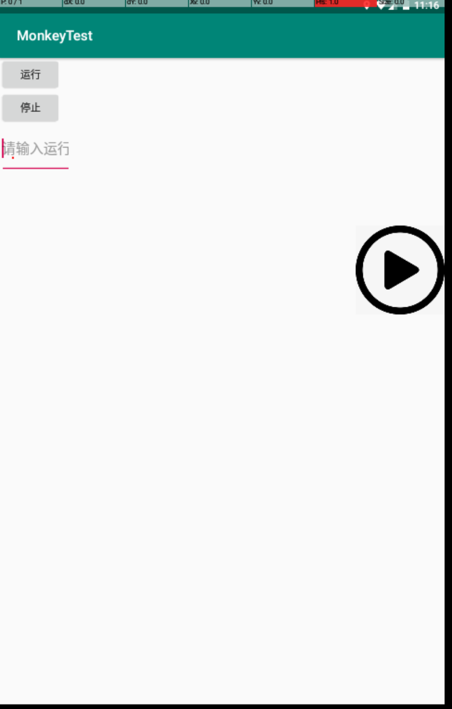

# 介绍

使用Android Uiautomator2脱机运行Monkey测试

# 安装方式

## 安装AndroidTest
```
gradle assembleAndroidTest

在/app/build/outputs/apk/androidTest/debug生成

adb install app-debug-androidTest.apk
```

## 安装MonkeyTest
```
gradle assembleRelease

在/app/build/outputs/apk/release生成

adb install app-release-unsigned.apk
```

# 运行效果

输入运行时间并点击运行按钮




